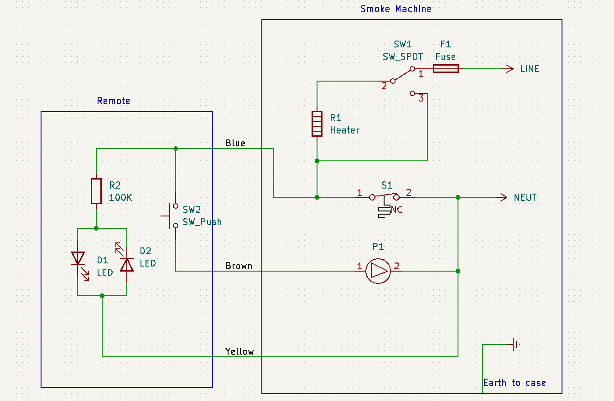

# Spiders
A halloween project involving LEDs, smoke generators and spiders.

## Reverse engineering a Smoke/Fog Machine
A cheap smoke machine was purchased as there was a risk it wouldn't survive the project. But I needn't have woried as it was pretty robust.

The device consisteded of a heater, pump and thermal switch. The remote was two diodes and a resistor with a simple push button.

## Microcontroller remote
To replace the remote, I wanted to replace like for like, so the switch became a relay and the LEDs became an opto-coupler.

## Pulse Counting
The code example PulseCounter.py shows how you can do a very rough frequency check by counting the number of pulses in a fixed period. For this project it was about determining if a mains voltage was present or not.  
